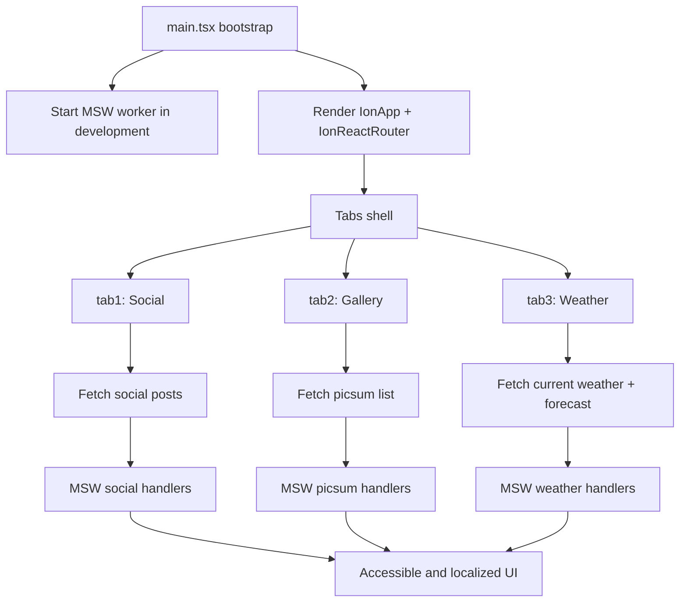

# Ionic React PoC (Parallel Migration)

Parallel Ionic React proof-of-concept migrated from the Angular app at ../ionic-poc.

## Scope

- Migration runs in this repository only (parallel PoC).
- Feature parity target: 3 tabs.
- Priority order: tab3 Weather first, then tab1 Social, then tab2 Gallery.

## Architecture

- App shell: Ionic tabs router in `src/App.tsx` with all three tabs available.
- Feature tabs:
  - Tab1 Social feed in `src/pages/tab1/Tab1Page.tsx`
  - Tab2 Image gallery in `src/pages/tab2/Tab2Page.tsx`
  - Tab3 Weather in `src/pages/tab3/Tab3Page.tsx`
- Shared i18n provider: `src/i18n/index.tsx` with `en` / `es` dictionaries.
- Mock API layer: `mocks/*` via MSW browser worker and Node server.
- Performance hooks: `src/performance/web-vitals.ts` plus Playwright and Lighthouse checks.

### App flow

## Reused from Angular source

- MSW handlers and setup under mocks/.
- API contracts under docs/\*.swagger.yaml.
- i18n dictionaries under src/i18n/locales/.
- Theme tokens in src/theme/variables.css.
- Performance setup concept: web-vitals + Playwright smoke + Lighthouse assertions.

## Quick start

1. nvm use
2. npm install
3. npm run dev

## Runbook

1. Start app: `npm run dev`
2. Run lint and structure rules: `npm run lint`
3. Run unit tests: `npm run test`
4. Run full e2e: `npm run test.e2e`
5. Run performance smoke: `npm run test:perf`
6. Run Lighthouse assertions: `npm run lighthouse`

For one-command local validation, use `npm run test:all`.

## Scripts

- npm run lint:eslint
- npm run lint:structure
- npm run lint
- npm test
- npm run test:render
- npm run test.unit
- npm run test.e2e:install
- npm run test.e2e
- npm run test:perf
- npm run lighthouse
- npm run lighthouse:ci

## File structure rules

- Every page must live in its own folder under `src/pages/<page-name>/`.
- Every shared component must live in its own folder under `src/components/<component-name>/`.
- Each page/component folder must contain:
  - primary `.tsx` file (`*Page.tsx` for pages)
  - `index.ts` barrel export
- These rules are enforced by `npm run lint:structure` and included in `npm run lint` and CI.

## Pre-commit behavior (parity with original app)

- Husky pre-commit runs `npm test`.
- Husky pre-commit runs `npm run test:render`.
- Husky pre-commit runs `npx lint-staged`.
- Husky commit-msg runs `npx --no -- commitlint --edit $1`.

## API mocking and real API strategy

See [docs/API_MOCKING.md](docs/API_MOCKING.md) for endpoint mapping, MSW behavior, and real API toggle notes.

MSW is configured for both runtime and tests:

- Browser worker startup in `src/main.tsx` using `mocks/browser.ts`.
- Node test server lifecycle in `src/setupTests.ts` using `mocks/server.ts`.
- Shared handlers in `mocks/handlers/*`.
- Worker file served from `public/mockServiceWorker.js`.

## Migration notes and gaps

See [docs/KNOWN_GAPS.md](docs/KNOWN_GAPS.md) for parity status and next increments.

## Playwright vs Cypress

- Playwright is the primary and only E2E framework in this PoC.
- Cypress was scaffold default noise and has been removed to avoid duplicate maintenance and flaky divergence.
- Keeping both is not necessary unless you intentionally run parallel framework evaluation.

## CI

CI workflow is in `.github/workflows/ci.yml` and includes:

- lint
- unit tests
- build
- Playwright browser install
- Playwright E2E
- performance smoke test
- Lighthouse assertions

## Project structure

- src/pages/tab3/Tab3Page.tsx: weather-first feature implementation.
- src/pages/tab1/Tab1Page.tsx: social feed baseline.
- src/pages/tab2/Tab2Page.tsx: gallery baseline.
- src/components/language-selector/LanguageSelector.tsx: reusable language switcher.
- src/i18n/: translation provider + locales.
- mocks/: shared API mocking handlers.
- e2e/: Playwright user-flow and performance smoke tests.
- docs/: OpenAPI contracts and migration checklist.

## Migration checklist

See docs/MIGRATION_TODO.md.
